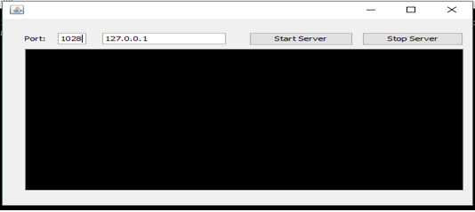
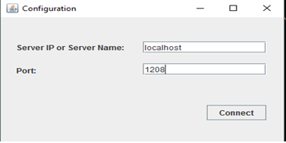
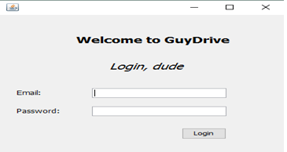
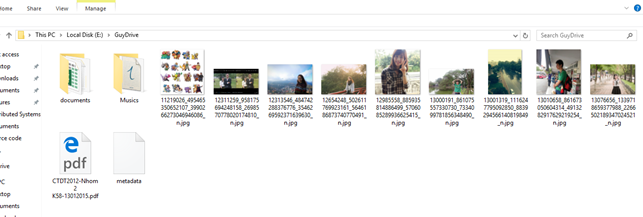

# mystorage
This is a distributed application named GuyDrive. This app is like Google drive, OneDrive, Dropbox. 
# How to install and run project
- Software and enviroment requirements
  - Java, JVM
  - Netbean or Eclipse
  - Mysql
  - Xampp or mysql workbench for managing database
- Install
  - Pull project from my github https://github.com/cuongnguyenngoc/mystorage.git
  - Import database named `mystorage.sql` to your database to storage metadata of user like `username`, `password`, `file_name`, `file_size`, `modified_time`, `delete_time`, `storage_path`, etc.
- Run
  - Run separately server and client orderly using Netbeans or any IDE you like.
- Results:
  - Server
    
    
    
  - Client
    
    
    
    
